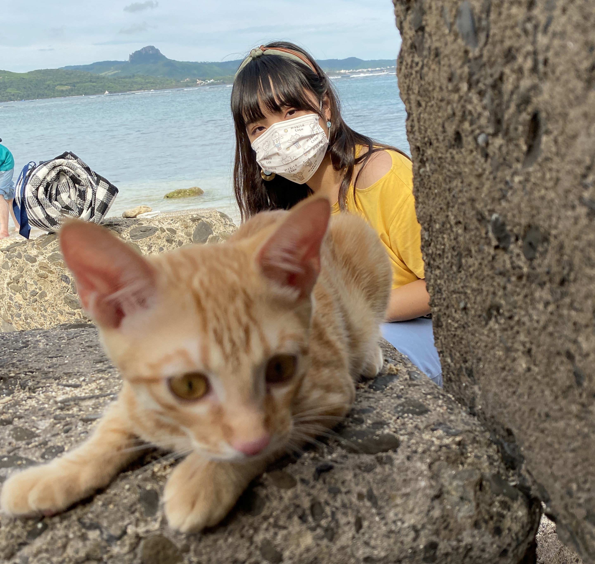
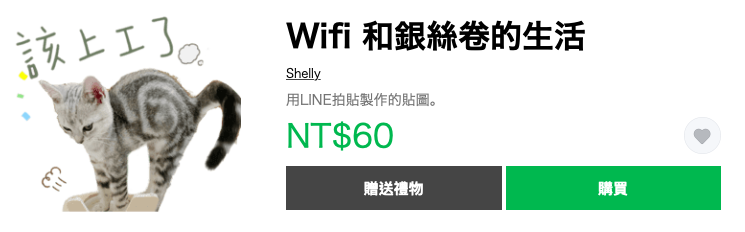

#關於我 
-
{#id .class width=500px}

>  #陳沛諭

> 和兩隻貓咪一起生活  
喜歡小動物  
喜歡品嚐甜點  
偶爾做做點心  

> 近期最想嘗試的事：學空中瑜伽

                     
                                 －                          
#關於兩隻貓咪的日常
-

> 迷克斯橘貓“Wifi”和美國短毛貓“銀絲卷”的日常，  
都會收錄在以下的IG中，  
如果想要看到他們日常的蠢照/美照，  
歡迎追蹤～  

{#id .class width=300px}

> 另外，為了紀念他們兩隻的存在，也製作了貼圖  

   
  [超連結在這～～](https://store.line.me/stickershop/product/16340534/zh-Hant)
   
                                 －    
#關於另一個經營的小帳
-
{#id .class width=300px}   

>因為工作的緣故，    
裡面包含中學的課程相關內容，  
還有不同學生的課堂風景，  
作為我另一種記錄生活的方式。

